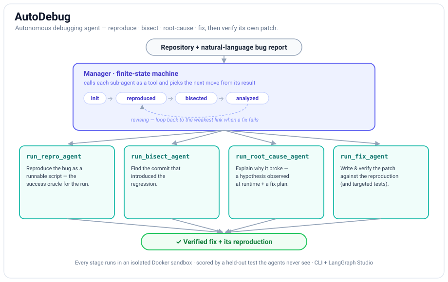

# AutoDebug

An end-to-end agentic debugger: given a repository and a bug report, it
**reproduces**, **bisects**, **root-causes**, and **fixes** the bug
automatically — then verifies the fix against a reproduction it built itself.

The agents see only what a human triager would: the repo and a natural-language
bug report. They are never given the benchmark's test — that is held out and
used only for independent scoring (see [Evaluation](#evaluation)).

---

## How it works

A **Manager** agent orchestrates four specialist sub-agents through a finite
state machine, calling each as a tool and deciding the next move from the signal
it returns:

<p align="center">
  
</p>

| Stage | Agent | Output |
|-------|-------|--------|
| **Reproduce** | `repro` | a minimal Python script that fails on the bug and passes once fixed — the oracle for the rest of the run |
| **Bisect** | `bisect` | the SHA of the commit that introduced the regression |
| **Root cause** | `root_cause` | a runtime-observed hypothesis + a concrete fix plan |
| **Fix** | `fix` | a patch that makes the reproduction (and targeted tests) pass |

If a fix fails verification the Manager enters **revising** and loops back to the
weakest link (repro, root cause, or another patch) until it succeeds or exhausts
its budget.

Setting `AUTODEBUG_MANAGER=0` falls back to a classic linear
`repro → bisect → root_cause → fix` pipeline with no Manager.

### Design notes

- **Isolated sandbox.** Every stage runs in a Docker container attached to a
  shared per-run volume; the host never touches the cloned files, so symlinks
  and on-disk state stay intact. One long-lived container per stage — filesystem
  state persists across tool calls within a stage; a hard per-command timeout
  keeps any single call from hanging the run.
- **Tool registry.** Any `make_<name>_tool` factory exported from
  [autodebug/tools/](autodebug/tools/) is auto-discovered; each agent's
  `config/agents/<name>.json` lists which tools it gets.
- **Prompt + budget config** live in [config/](config/) — system prompts in
  `config/prompts/*.yaml`, per-agent model/budget/tool settings in
  `config/agents/*.json` — so behavior is tunable without code changes.

---

## Setup

**Requirements:** Python ≥ 3.11, Docker, and an LLM API key.

```bash
# 1. Environment + dependencies
conda create -n autodebug python=3.11 && conda activate autodebug
pip install -e ".[dev,eval,tracing]"

# 2. Build the sandbox image the agents run code in
docker build -t autodebug-sandbox:latest ./docker/sandbox

# 3. Configure credentials and models
cp .env.example .env   # then edit — see Configuration below
```

---

## Usage

```bash
autodebug debug https://github.com/psf/black \
  --bug "black crashes in AWS Lambda: ProcessPoolExecutor fails when /dev/shm is unavailable" \
  --good <known-good-commit-or-date>     # optional, helps bisect
```

`--bug` can be replaced (or augmented) by `--issue <github-issue-url>`: the issue's
title and body are fetched and folded into the bug report (set `GITHUB_TOKEN` for
private repos or higher rate limits).

```bash
autodebug debug https://github.com/psf/black --issue https://github.com/psf/black/issues/1234
```

It streams progress live and **pauses to ask you when it gets stuck** — a stage
exhausts its retries, or the session budget runs out (human-in-the-loop). Pass
`--unattended` to disable the prompts (for CI/batch); it then runs to completion and
reports the result.

```bash
autodebug debug https://github.com/psf/black --bug "..."               # interactive (HITL)
autodebug debug https://github.com/psf/black --bug "..." --unattended  # no prompts (CI)
```

The CLI exposes the same run parameters as the Studio config panel, all optional:

| Flag | Purpose |
|------|---------|
| `--ref` | commit SHA / branch to check out (default: repository HEAD) |
| `--good` | a known-good commit or date (hint for bisect) |
| `--requirements` | pinned deps to layer on top — a path to a requirements/freeze file, or inline text |
| `--setup-command` | extra shell command run in the repo after dependency install |
| `--python-version` | Python version for the sandbox env (e.g. `3.11`) |

Or from Python — **one graph** drives every entry point (CLI, Studio, eval):

```python
from autodebug.registry import AutoDebugRegistry

# unattended (no HITL); same graph Studio serves, just hitl=False
graph = AutoDebugRegistry.from_file().build_graph(hitl=False)
final = graph.invoke(
    {"messages": [{"role": "user", "content": "black crashes in AWS Lambda ..."}]},
    config={"configurable": {"thread_id": "demo", "repo_url": "https://github.com/psf/black"}},
)
print(final["debug"]["stage"], final["debug"].get("fix"))
```

---

## Interactive serving (Agent Chat UI + human-in-the-loop)

There is **one graph** — `AutoDebugRegistry.build_graph(hitl=…)`
([registry.py](autodebug/registry.py) → [graph/interactive.py](autodebug/graph/interactive.py)) —
and **every** entry point runs it: the CLI, the eval harness, and the LangGraph dev
server below. The only difference is the `hitl` toggle (interactive vs unattended).
To serve it for a chat UI:

```bash
# Install the serving extra (the LangGraph dev server)
pip install -e ".[serve]"

# Serve the graph on http://localhost:2024 (also prints a LangGraph Studio URL)
langgraph dev
```

`langgraph dev` reads [langgraph.json](langgraph.json), serves the `autodebug` graph
over the standard LangGraph protocol, and provides persistence so threads, streaming,
and interrupts work. Two ways to use it — **no custom backend needed**:

**Submitting a bug report.** The graph needs two things: a **repo URL** and a
**bug report**. The simplest way — works in *both* UIs — is to put the repo URL on
its own line in the chat message, followed by the report:

```
https://github.com/psf/black
black crashes in AWS Lambda: ProcessPoolExecutor fails when /dev/shm is unavailable
```

The first URL is taken as the repo; the rest is the bug report. (Optional
`ref`/`known_good`/`requirements`/… still come from the run config.)

- **LangGraph Studio** — open the `smith.langchain.com/studio?baseUrl=…` URL printed
  by `langgraph dev`. Either paste the repo URL + report as the message (above), or use
  the **config panel** — the graph declares a context schema (`repo_url`, `ref`,
  `known_good`, `issue_url`, `requirements`, `setup_command`, `python_version`), so
  those appear as form fields; set `repo_url` there and type just the bug as the message.
- **Agent Chat UI** — point [Agent Chat UI](https://github.com/langchain-ai/agent-chat-ui)
  (a separate Next.js frontend) at `http://localhost:2024` with assistant id
  `autodebug`. It has no config panel, so use the **message form above** (repo URL on the
  first line) — that's the whole run target.

**Architecture.** The graph is `prepare → clone → manager`, where `manager` is the
Manager `create_agent` graph compiled **as a subgraph node** that shares the parent's
checkpointer. The Manager's pipeline state + FSM phase live in the checkpointed `debug` /
`fsm_phase` channels, so the agent is **resumable** and its `interrupt()`s bubble natively
to the stream (Studio renders them). The one factory, `registry.build_graph(hitl=…)`,
builds this for everyone; `hitl=False` (eval/`--unattended`) just omits the HITL middleware.

**Human-in-the-loop — two triggers, native.** With `hitl=True`:
1. **Stage stuck** — a blocking stage (repro/root_cause/fix) exhausts its retries →
   `interrupt()` with a summary *before* the Manager autonomously revises
   (`stage_hitl_middleware`, [fsm.py](autodebug/fsm.py)).
2. **Budget exhausted** — when the session cost/time cap is hit, `interrupt()` instead of
   ending; on resume you grant a fresh budget window + guidance, or `skip` to stop
   (`session_budget_middleware`'s hitl mode, [base.py](autodebug/agents/base.py)).

Either way you reply with `Command(resume=<guidance>)` (or at the CLI prompt) and the
Manager **continues the same conversation** — true mid-conversation resume, guidance
folded in. With `hitl=False` (eval/CI) a stage failure records the failure and budget
exhaustion ends the run — it never blocks on input that won't come.

> The eval harness runs the **same graph** with `hitl=False` (via `run_pipeline`) and
> scores the result with the held-out test in a **separate** sandbox — so the agent graph
> never sees test metadata (production fidelity preserved).

---

## Configuration

All configuration is via environment variables (loaded from `.env`). The most
common ones — see [.env.example](.env.example) for the full list:

| Variable | Purpose | Default |
|----------|---------|---------|
| `AUTODEBUG_MODEL` / `AUTODEBUG_MODEL_PROVIDER` | LLM and provider (any LangChain `init_chat_model` target — Anthropic, OpenAI, OpenRouter, Ollama, …) | `claude-sonnet-4-6` / `anthropic` |
| `AUTODEBUG_FIX_MODEL` | Optional stronger model just for fix generation | — |
| `AUTODEBUG_MANAGER` | `1` = Manager FSM, `0` = linear pipeline | `1` |
| `AUTODEBUG_PROMPT_OPTIM` | Rewrite a failing agent's prompt from its trajectory on retry | `1` |
| `AUTODEBUG_MEMORY_ENABLED` | Memory **recall** via LangMem (memories are always written; this gates reads) | `0` |
| `SANDBOX_IMAGE` / `SANDBOX_TIMEOUT_SECONDS` / `SANDBOX_MEM_LIMIT` | Docker sandbox knobs | `autodebug-sandbox:latest` / `300` / `512m` |
| `GITHUB_TOKEN` | Reading GitHub issues via `--issue` (higher rate limits / private repos) | — |

Per-agent knobs (time/cost budget, model, allowed tools, tool-call limits) live
in `config/agents/*.json`; their system prompts are in `config/prompts/*.yaml`.

---

## Evaluation

The eval harness runs AutoDebug against a dataset of real bugs and scores each
stage independently — the agents never see the test.

```bash
# Run the whole dataset (BugsInPy-derived, 501 instances across 17 projects)
python eval/run_eval.py

# First N instances, or specific ones
python eval/run_eval.py eval/datasets/buginspy.json 10
python eval/run_eval.py --ids black-1,pandas-23
```

Metrics are printed and saved to `eval/results/run_<timestamp>.json`:
`repro_rate`, `bisect_accuracy`, `fix_rate`, plus token/cost/wall-time averages.

### Results

On a **348-instance** [BugsInPy](https://github.com/soarsmu/BugsInPy)-derived subset
spanning **10 projects**, AutoDebug **reproduces 88%** of bugs and **fixes 67%** of
the *scoreable* ones (a fix is counted only after the gold baseline proves the
instance scoreable — see below).

| Metric | Value |
|--------|-------|
| Reproduction rate | **87.9%** (306 / 348) |
| Fix rate (of scoreable) | **67.2%** (223 / 332) |
| Bisect — culprit file overlap | 64.1% |
| Bisect — exact culprit SHA | 1.7% |
| Excluded as `harness_invalid` | 16 / 348 |
| Avg cost / instance | ~$6.15 |

Per project:

| Project | N | Fixed | Failed | No patch | Excluded | Fix rate |
|---------|---:|---:|---:|---:|---:|---:|
| ansible | 18 | 10 | 4 | 3 | 1 | 59% |
| black | 23 | 13 | 6 | 3 | 1 | 59% |
| cookiecutter | 4 | 2 | 2 | 0 | 0 | 50% |
| fastapi | 16 | 13 | 2 | 0 | 1 | 87% |
| httpie | 5 | 0 | 0 | 5 | 0 | 0% |
| keras | 45 | 31 | 7 | 6 | 1 | 70% |
| luigi | 33 | 28 | 1 | 2 | 2 | 90% |
| matplotlib | 30 | 24 | 3 | 3 | 0 | 80% |
| pandas | 169 | 99 | 26 | 35 | 9 | 62% |
| sanic | 5 | 3 | 0 | 1 | 1 | 75% |
| **Total** | **348** | **223** | **51** | **58** | **16** | **67.2%** |

*Fix rate is over scoreable instances only (excluding `harness_invalid`). "Exact
culprit SHA" is deliberately strict — a regression is usually introduced across a
range of commits, so **file overlap** is the more meaningful bisect signal.
Numbers are a single unattended run with OpenRouter's free models; the model, budgets,
and prompts are all configurable, so your mileage will vary.*

### Fix scoring distinguishes a bad fix from a broken harness

A fix is scored only after the harness proves the instance is **scoreable** with
a *gold baseline*: the official test must **pass at the fixed commit** and
**fail at the buggy commit**. If it doesn't — a missing test-only dependency, a
broken import, a wrong test command — the instance is flagged `harness_invalid`
and **excluded** from `fix_rate` instead of silently counting as a fix failure.
The metrics report `fix_scoreable` and `harness_invalid` counts separately, so a
0% fix rate always means the agent failed, not the environment.

To make instances scoreable, the sandbox installs the project's **test/dev**
dependencies (e.g. `.[test]`, `.[dev]`, dev-requirement files) on top of its
runtime deps, so the official test module can actually import.

Useful toggles: `AUTODEBUG_EVAL_BASELINE=0` disables gold-baseline validation
(falls back to output heuristics); `AUTODEBUG_PIP_INSTALL=0` skips dependency
installation.

---

## Tracing

AutoDebug auto-instruments every LangChain/LangGraph call (model responses, tool
calls, chain execution) with Phoenix / OpenTelemetry.

```bash
# 1. Start Phoenix (UI at http://localhost:6006)
python -m phoenix.server.main serve

# 2. Enable tracing for the run
export AUTODEBUG_PHOENIX_ENABLED=true

# 3. Inspect the latest pipeline runs from the CLI
python fetch_traces.py
```

---

## Testing

```bash
conda run -n autodebug python -m pytest tests/ -q
```

---

## Project layout

```
autodebug/
  agents/      manager + repro/bisect/root_cause/fix sub-agents
  tools/       auto-discovered make_<name>_tool factories
  sandbox/     Docker volume + long-lived container runner
  graph/       pipeline.py (imperative run_pipeline) + interactive.py (compiled graph + HITL)
  fsm.py       Manager finite state machine
  registry.py  config loading + tool building
  state.py     DebugState and per-stage result models
langgraph.json   serves the graph for `langgraph dev` / Studio / Agent Chat UI
config/
  agents/      per-agent model/budget/tool config (JSON)
  prompts/     per-agent system prompts (YAML)
eval/
  run_eval.py  evaluation harness + independent fix scoring
  datasets/    buginspy.json
.skills/       agent-loadable debugging skills (investigate, bisect-tricks, …)
docker/sandbox Dockerfile for the execution image
fetch_traces.py  pretty-print the latest Phoenix traces
```

---

## Contributing

Contributions are very welcome — agents, tools, sandbox improvements, eval
coverage, docs, and bug fixes alike. See **[CONTRIBUTING.md](CONTRIBUTING.md)** for
setup, the test workflow, and code style. Good first issues include tidying lint
findings and adding eval coverage. Please open an issue to discuss anything
non-trivial before sending a large PR.

## License

[MIT](LICENSE) © 2026 Shayan Shirahmad

